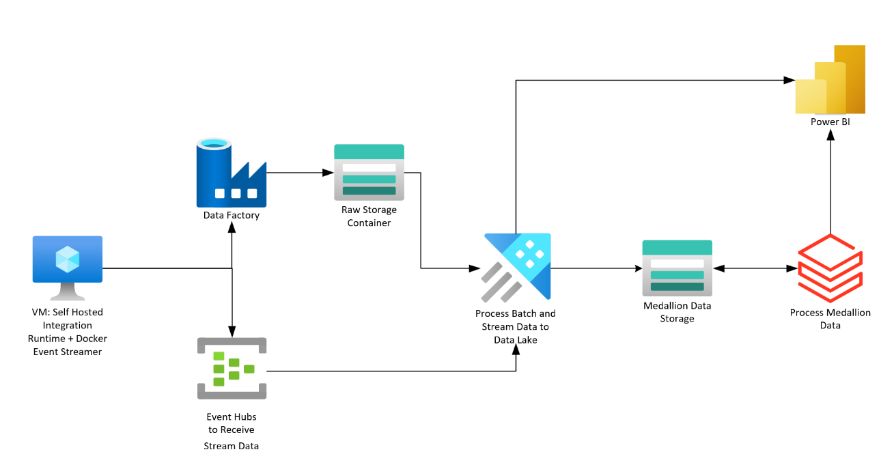

## Repo Descripiton
___

This Repo is meant to detail the steps to use Azure Data Factory, Azure Data Explorer, Azure Databricks, and Azure Event Hubs to create an Architecture that supports both Batch and Streaming use cases. The primary area for consuming data produced in this process will be Azure Data Lake Gen2 hence the Lakehouse architecture.

## Pre-Requisites
___
1) An **empty** sandbox Resource Group in Azure. To reduce the number of parameters for deployment, the resources that only enforce unique naming at the Resource Group level were given default names. More on naming requirements [here](https://learn.microsoft.com/en-us/azure/azure-resource-manager/management/resource-name-rules).
2) [Contributor](https://learn.microsoft.com/en-us/azure/role-based-access-control/quickstart-assign-role-user-portal) Access to the empty Resource Group.
3) Unity Catalog (and Access Connector) set up for use in Azure Databricks.
4) The below Resource Providers are [registered](https://learn.microsoft.com/en-us/azure/azure-resource-manager/management/resource-providers-and-types#register-resource-provider) for the subscription being used.
   - Microsoft.Compute
   - Microsoft.DataFactory
   - Microsoft.Databricks
   - Microsoft.EventHub
   - Microsoft.Kusto
   - Microsoft.Logic
   - Microsoft.Network
   - Microsoft.Storage

## Acronyms
____
__ADF:__ Azure Data Factory

__ADX:__ Azure Data Explorer

__VM:__ Virtual Machine

__ADLS:__ Azure Data Lake Storage
   
## Steps
___
1) __VSCode:__ [Deploy Resources](./docs/bicep/deploy.md)
2) __Key Vault:__ [Set up Pre-Requisite Secrets](./docs/akv/setup.md)
3) __Logic Apps:__ [Manage Azure Bastion with Logic Apps](./docs/logicapps/setUpBastionLogicApps.md)
4) __VM:__ [Set up Docker container for Streaming dataset](./docs/shirvm/streamingSetUp.md)
5) __VM:__ [Create Self Hosted Integration Runtime service for Batch dataset](./docs/shirvm/batchSetUp.md)
6) __ADLS:__ [Prepare storage for ADF and ADX](./docs/adls/setUp.md)
7) __ADX:__[Set up ADX for ADF/Ingestion](./docs/adx/setUp.md)
8) __ADF:__ [Set up Linked Services and Global Parameters](./docs/adf/linkedServices.md)
9) __ADF/ADLS:__ [Import Pipelines and Create Metadata Control Table]()
10) __ADX:__ Set up Ingestion Streams
11) __ADX:__ Set up Continuous Export to ADLS
12) __Databricks:__ Set up connection to Raw storage in Azure Databricks Unity Catalog
13) __Databricks:__ Create a notebook to bring data to the Bronze layer
14) __Databricks:__ Create SQL Scripts to bring data through the Silver and Gold layers
15) __Databricks:__ Create a Workflow to Automate Medallion load
16) 