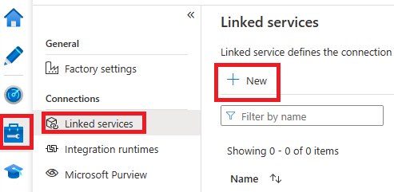
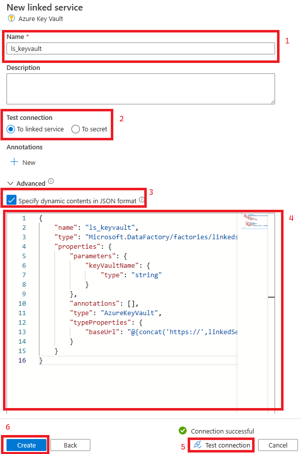
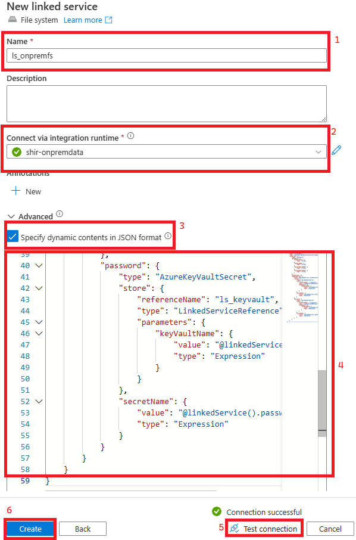
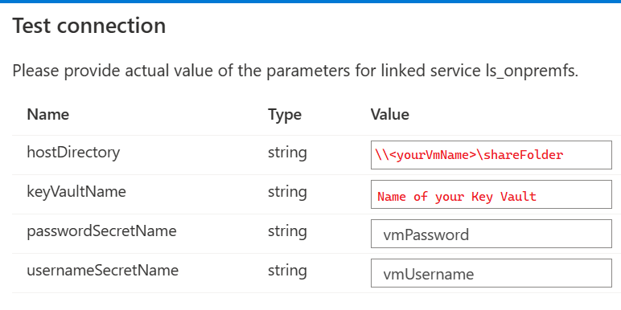
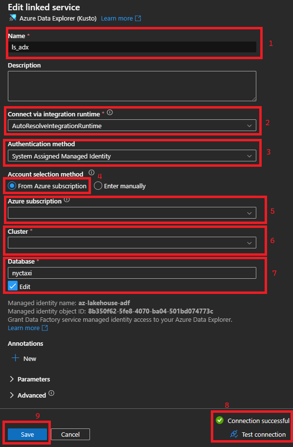
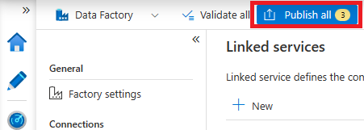
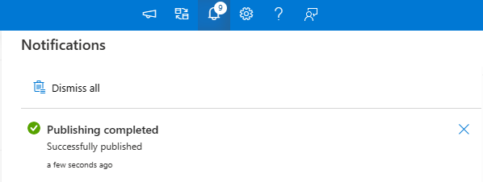

## Set up Linked Services and Global Parameters in ADF
### Summary
Linked Services will define how we connect to the various integration points from Azure Data Factory. In this example, we'll set up connections to Azure Key Vault, Azure Data Lake Storage Gen 2, and the on-premesis filesystem residing on the Self Hosted Integration Runtime Virtual Machine. Per the recommendation, these linked services will be [highly parameterized](https://learn.microsoft.com/en-us/azure/data-factory/parameterize-linked-services?tabs=data-factory).

### Steps
#### Set up Azure Key Vault
1) Set up a new Linked Services in Azure Data factory by following the steps in the image below.

    

2) When the next screen comes up, search for and select Azure Key Vault.
3) Name the service ls_keyvault, expand the advanced section, tick the box that says "Specify dynamic contents in JSON format", and paste in the contents of the [ls_keyvault.json](../../code/adf/linkedservices/ls_keyvault.json) file.
   
    

4) Test your connection and enter the name of your Key Vault when prompted. If your [Access Policies](../akv/setup.md) are set up correctly you should receive a message saying "Connection successful"

#### Set up Azure Data Lake
1) Add a new Linked Service.
2) When pompted, search for and select Azure Data Lake Storage Gen2.
3) Name the service ls_datalake and follow the same steps from the Key Vault linked service but copy the contents of the [ls_datalake.json](../../code/adf/linkedservices/ls_datalake.json) file into the box that appears after clicking "Specify dynamic contents in JSON format".
4) Test your connection and enter the name of your Storage Account when prompted. If your [Storage Permissions ](../storage/addStorageMI.md) are set up correctly you should receive a message saying "Connection successful"

#### Set up On Prem File System
1) Add a new Linked Service.
2) When prompted, search for and select File System.
3) Name the service ls_onpremfs,**make sure you choose your Self Hosted Integration Runtime as the runtime**, expand the advanced section, tick the box that says "Specify dynamic contents in JSON format", and paste in the contents of the [ls_onpremfs.json](../../code/adf/linkedservices/ls_onpremfs.json) file.

    

4) Test your connection and enter the parameters below. If the Self Hosted Integration Runtime and the Shared Folder are set up correctly you should receive a message saying "Connection successful". Click Create after a succesful test.

    

5) **IMPORTANT** After you create the linked service, re-open it and un-check and re-check the "Specify dynamic contents in JSON" tick box. If you do not do this your pipelines will fail later on witha message about not being able to find the ls_keyvault Linked Service Reference.

#### Set up Azure Data Explorer Linked Service
1) Add a new Linked Service
2) When prompted, search for and select Azure Data Explorer.
3) Name the service ls_adx
4) Create a connection by setting up like the screenshot below (Choose your Subscription + Cluster in steps 5 and 6)

    

#### Publish the Linked Services
1) Click the Publish button in Azure Data Factory to deploy the Linked Services and Global Parameters.

    

2) Watch your notifications to ensure the Publishing succeeds.

    
