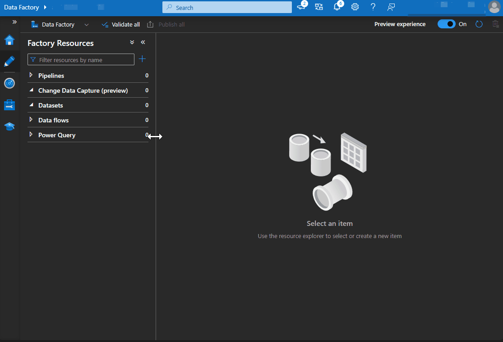
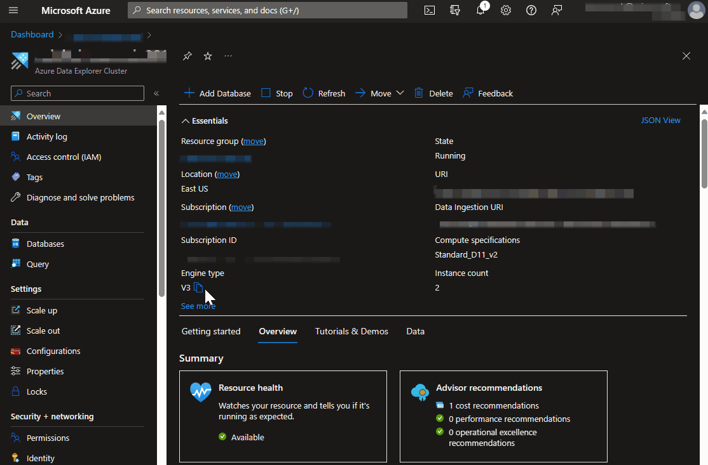

## Import Pipelines and Create Metadata Control Table
### Summary
This walkthrough is to show you how to import the Copy Pipelines into Azure Data Factory. Those copy pipelines depend on metadata that will be stored in Azure Data Explorer. It is advisable to work in this fashion as it pipelines+metadata store to serve as a framework for copy processes. 

### Import Pipelines and Datasets

1) Follow the process below to import the [pl_copyData_00_runProcess.zip](../../code/adf/pipelines/pl_copyData_00_runProcess.zip) file into ADF. This will import your Pipelines and Datasets and point them directly at the Linked Services you already configured.

    

### Set up metadata storage in Azure Data Explorer

1) Navigate to your Azure Data Explorer cluster in Azure Portal. 
2) Open follow the below path to open your cluster in [dataexplorer.azure.com](https://dataexplorer.azure.com/). Now that your cluster is added you can visit this site at any point to run queries, set up ingestion, etc.

    

3) Copy the code in [setUpMetadataStore](../../code/kusto/00%20-%20setUpMetadataStore.kql) kql script into the query window you just opened. (Pointed at the nyctaxi database)
4) Run each line of code according to the directions in the script. Once the metadata store is created, move on to the next step.