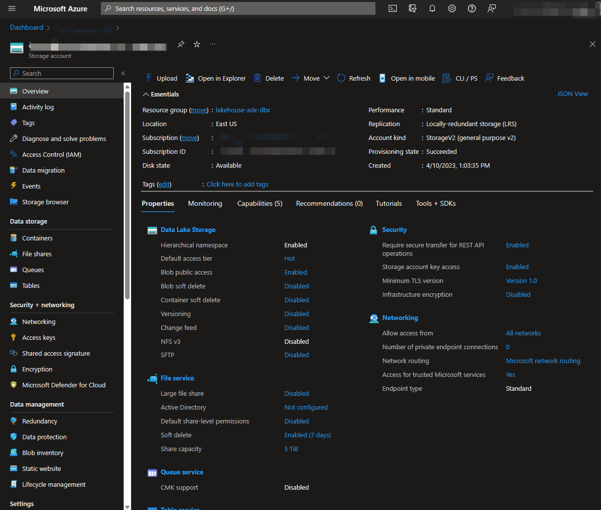

## Prepare storage for ADF and ADX
### Summary
___
In this guide, we're going to grant the Managed Identities that represent Azure Data Factory and Azure Data Explorer the Storage Blob Contributor role. This will allow the managed identities to perform the tasks of creating and removing new files and folders on Azure Data Lake Storage. These permissions will need to be in place for Downstream processes to work.

### Set up Contributor Access in the Portal
___
1) In [portal.azure.com](portal.azure.com), go to the ADLS resource set up on deployment.
2) Follow the steps below to add the Managed Identities as Storage Blob Data Contributor.

    