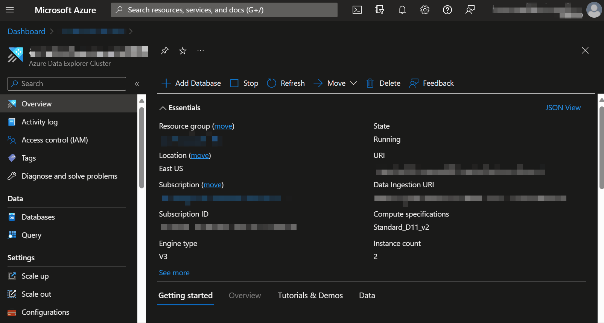
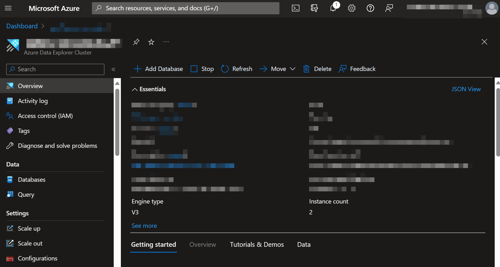

## Prepare ADX for ADF/Ingestion
### Summary
Azure Data Explorer has its own Role-Based Access Controls and in this walkthrough we'll set up the permissions needed to enable ADF to Read and Write from the nyctaxi database and enable your user to use ADX's managed identity to set up continuous export to Azure Data Lake Storage. Roles and permissions are outlined in [this document](https://learn.microsoft.com/en-us/azure/data-explorer/kusto/access-control/role-based-access-control#roles-and-permissions).

### Grant your user AllDatabasesAdmin Role
Go to your Azure Data Explorer resource in Azure Portal and follow the steps below to grant your user the AllDatabasesAdmin role.

### Grant ADF's Managed Identity Admin Role on the Database
Go to the Azure Data Explorer resource in Azure Portal and follow the steps below to grant Azure Data Factory's Managed Identity Admin access to the nyctaxi database.
    
