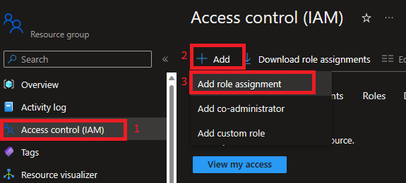
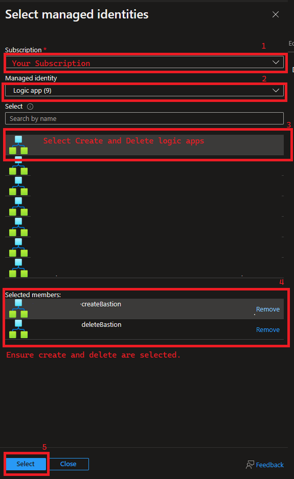
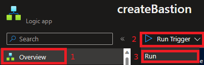
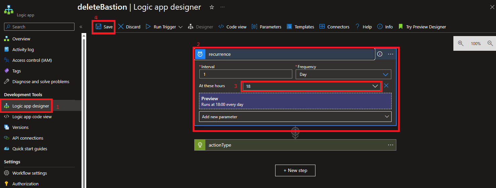
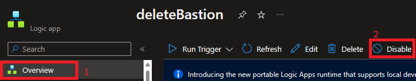

## Deploy Bastion using Logic App
___

### Summary 
[Azure Bastion](https://learn.microsoft.com/en-us/azure/bastion/bastion-overview) is a service that allows browser-based access to a Virtual Machine. It is being managed by Logic Apps in this specific architecture because it incurs costs 24x7. Since the architecture deployed by this repository is intended to be a Proof of Concept, conserving cost where possible is paramount.

We will deploy two Logic Apps to support this cost saving measure.
- __logicApp-createBastion__ - This is HTTP triggered. The Bastion Host is not created by default and will need deployed each time you want to use it if you are using a scheduled deletion.
- __logicApp-deleteBastion__ - This is triggered by time recurrence. By default it will delete your Bastion host at 6pm daily. This walkthrough will show you how to modify/disable this Logic App.

### Give Logic Apps Access to Deploy/Delete Resources
1) Go to the [Azure Portal](portal.azure.com) and the Resource Group in the Subscription where your assets are deployed.
2) Follow the Screenshot below to create a new role assignment in your Resource Group.

    

3) On the subsequent screen, choose "Privileged administrator roles" and click Next.
4) Choose Contributor and click Next
5) Choose Managed identity and click the "+ Select members" link.
6) Choose the Managed Identities representing your Logic Apps as shown in the screenshot below.

    

7) Click Review+Assign until the roles are assigned. (Can be verified by watching your Azure Portal notifications.)

### Deploy Bastion with Logic Apps
1) Open the logicApp-createBastion Logic App resource in the Azure Portal.
2) Run the Logic App by following the screenshot below. 

    

3) You can review Run History from the same Overview screen you Ran the Logic App from. You should receive a response (Success or Failed) in a matter of seconds.

### Delete Bastion with Logic Apps
1) Open the logicApp-deleteBastion Logic App resource in the Azure Portal.
2) Go to Logic App Designer and set the delete time to the time that best works with your Work Schedule. Save once done.

    

3) If you want to keep your Bastion host running 24x7, this Logic App can be disabled in the Logic App Overview.

    

