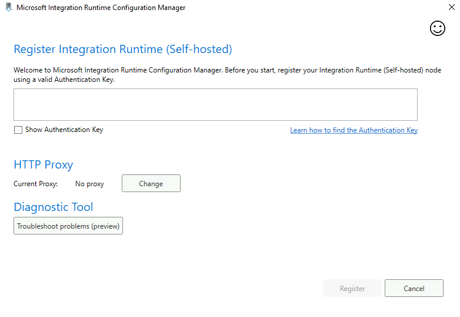
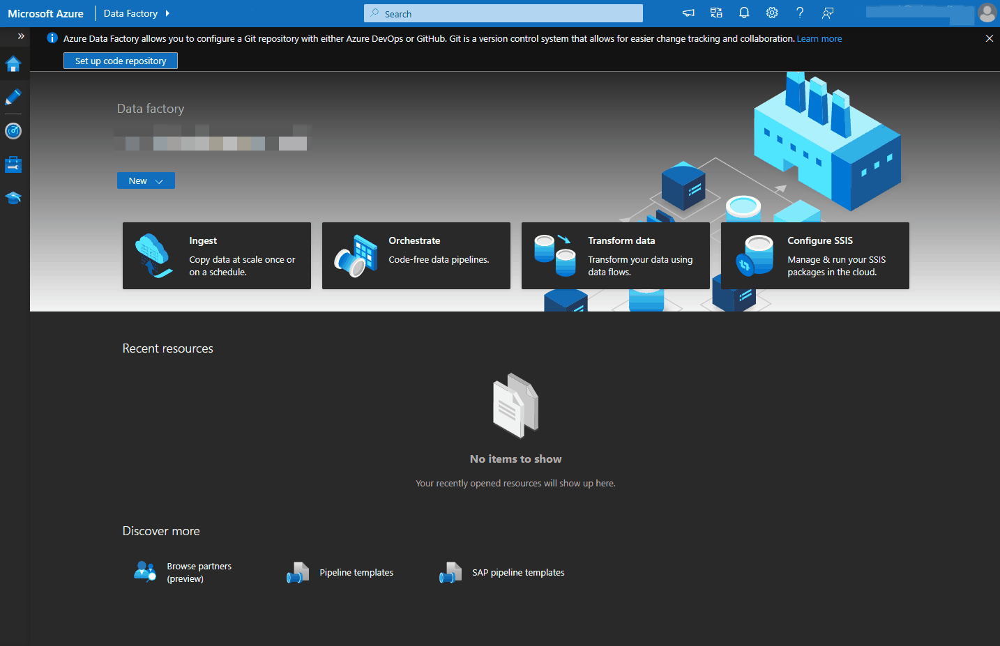
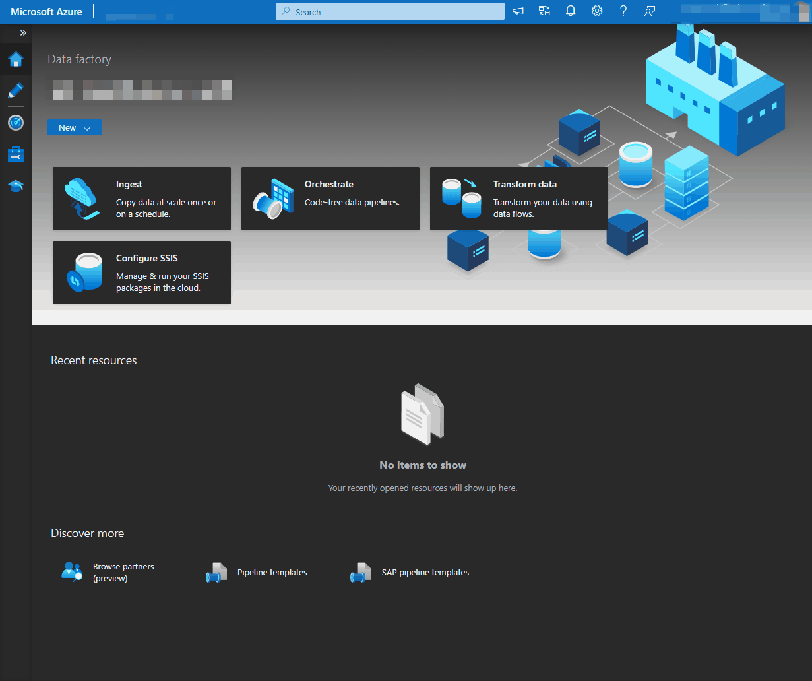
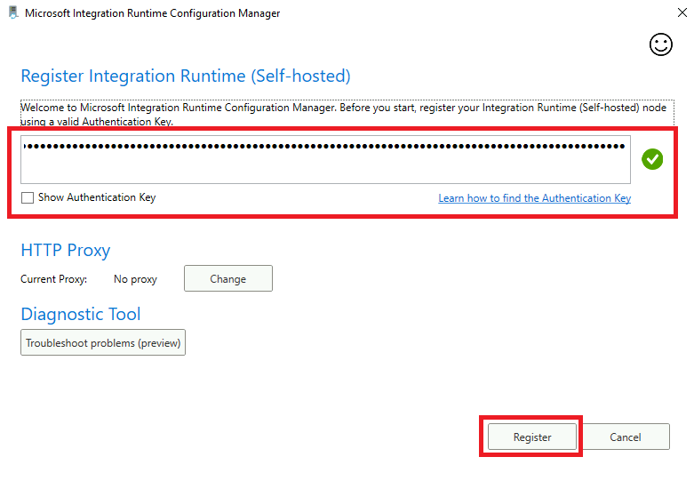
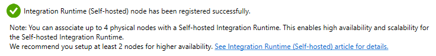
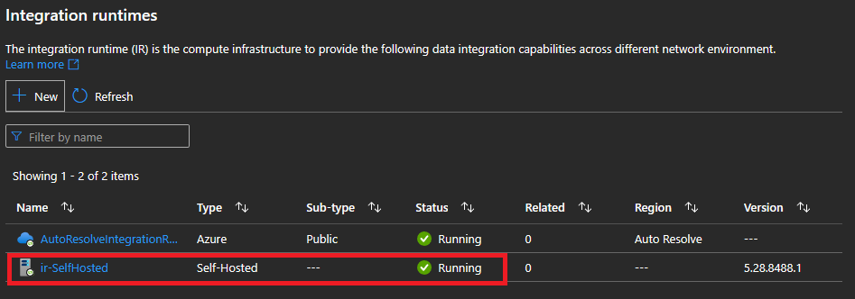

## Create Self Hosted Integration Runtime service for Batch dataset
### Summary
A Self Hosted Integration Runtime differentiates itself from a regular Azure Integration Runtime in Azure Data Factory by requiring infrastructure to be manually provisioned to host it. The steps in this walkthough serve as a guide to connect the Azure Data Factory resource to the Virtual Machine host. Also, you'll download some data to the host to be used in data loading and transformation exercises in ADF.
    
###  Steps
#### Download Integration Runtime and Configure 
1) Open your VM per the instructions in the [Streaming guide](./streamingSetUp.md). 
2) Once in your VM, open up the Edge browser and follow this [link](https://www.microsoft.com/en-us/download/details.aspx?id=39717) to download the Integration Runtime Setup to your VM.
3) After the download has completed, run the Setup and install it to the default location. Once the Setup is complete, the below screen should show up.

      

#### Create Integration Runtime in ADF
1) Open adf.azure.com and select the Data Factory deployed with the Resource Group used in this Proof of Concept.
2) Follow the steps below to add a Self Hosted Integration Runtime.
   
    

3) Follow the steps below to retreive a key to paste into the Self Hosted Integration Runtime application created on the Virtual Machine.

      


#### Finish Runtime Setup on VM
1) Return to the VM and the Integration Runtime Configuration Manager, paste the Authentication Key into the dialog box, and click Register. *If the Integration Runtime Configuration Manager is minimized, check your system tray*

      

2) On the next screen, review your Integration Runtime node name and click Finish.
3) Give the integration runtime a bit to initialize and you should receive the below message in the Integration Runtime Configuration Manager

      

4) Open up Windows Command Prompt, input the command below, and press Enter. This being done to allow the SHIR to read the local file system as outlined [here](https://learn.microsoft.com/en-us/azure/data-factory/create-self-hosted-integration-runtime?tabs=data-factory#set-up-an-existing-self-hosted-ir-via-local-powershell). This is likely not something that would be enabled in production but will work fine for Proof-Of-Concept purposes.

```
"C:\Program Files\Microsoft Integration Runtime\5.0\Shared\dmgcmd.exe" -elma
```

#### Verify Runtime is working in ADF
1) Return to ADF and refresh your integration runtimes. Your Self Hosted Integration Runtime should now have the status of "Running".
      