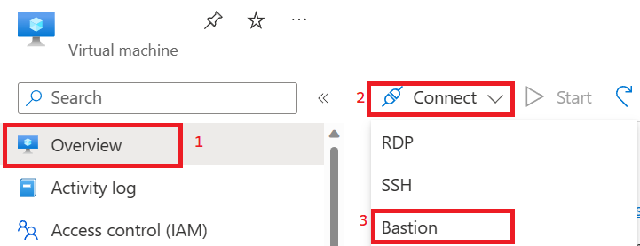
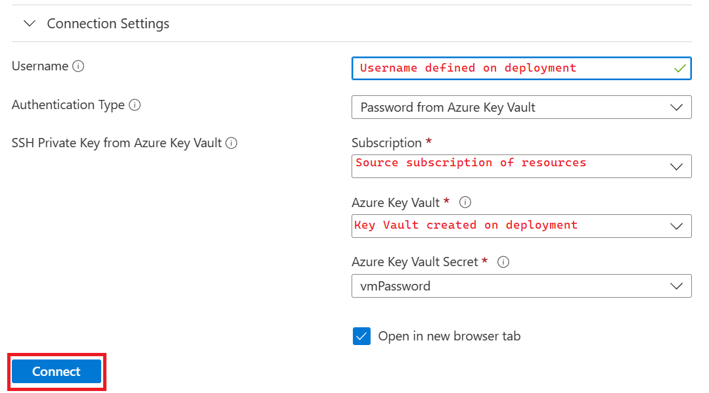
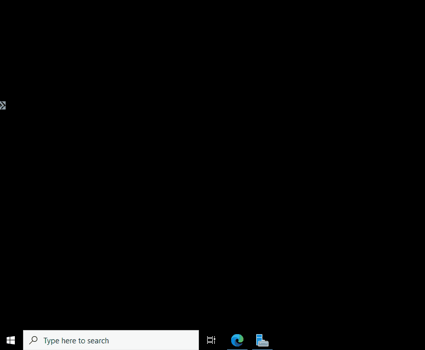
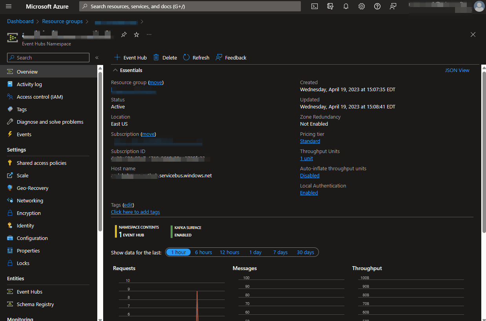
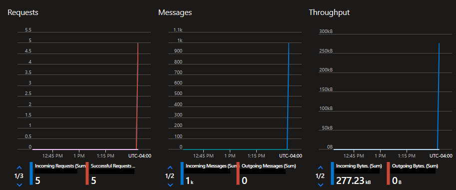

## Log into Bastion Host
___
1)  Go to the Azure Portal and the Virtual Machine resource deployed in previous steps.
2)  On the Overview screen click Connect and select Bastion

      
3) On the subsequent screen either manually input the Virtual Machine Username and Password as defined on deployment or use the Azure Key Vault Secret created in previous steps.


      
4) This should open up a new browser window with your VM. If prompted to allow clipboard access you should allow as you'll likely be pasting text into Bastion in a future step.

## Create Folders and a Share
___
1) On the VM, open the command line.

    

2) Type the below command to create a new folder to hold the NYCTaxi Data that will eventually be sent to Azure
      ```
      md c:\rawfiles\tripdata c:\rawfiles\faredata
      ```
3) Type the below command to share the base folder. This will make it easer to see the folder from Azure Data Factory.
      ```
      net share shareFolder=C:\rawfiles
      ```

## Install Ubuntu in Windows Subsystem for Linux
___
1) In the open Command Prompt, run the command below to install the Windows Subsystem for Linux
    ```
    wsl --install
    ```

2) WSL will require a restart to finish the install. Run the below command to initiate the restart. You can stay connected to Bastion until the VM comes back up. Bastion will reconnect on its own.
    ```
    shutdown -r
    ```
3) After restarting, wait for Ubuntu to install.
4) Set your username and password for Linux. Once you've done this you should be able to open up Ubuntu from the Start Menu

## Download Repository Data and Move Data Files
___
1) Open Ubuntu from the Start Menu
2) Pull the repository contents
    ```
    git clone https://github.com/sqlzack/analytics-adx-dbx.git /mnt/c/repo/analytics-adx-dbx
    ```
3) Move the Sample Data Files to their Source Paths by running the commands below.
    ```
    cp /mnt/c/repo/analytics-adx-dbx/data/trip_data_smol.csv /mnt/c/rawfiles/tripdata/

    cp /mnt/c/repo/analytics-adx-dbx/data/fare_data_smol.csv /mnt/c/rawfiles/faredata/
    ```

## Install Docker and Pull Image
___
1) In the Ubuntu prompt, upgrade package lists by running the below command.
    ```
    sudo apt-get update
    ```
2) Run the below command to install Docker
    ```
    sudo apt-get install docker podman-docker
    ```

4) Switch to the directory containing the Dockerfile, which we'll use to build our docker image.
    ```
    cd /mnt/c/repo/analytics-adx-dbx/code/docker/
    ```
5) Build the Dockerfile (This may take a moment)
    ```
    docker build -t eventstream .
    ```

## Set up and run Stream
___
1) In Windows File Explorer, navigate to C:\repo\analytics-adx-dbx\code\docker.
2) Open the main.env file in notepad. It should look like the below.
```
FARE_DATA_PATH=./FareData
FARE_EVENTH_HUB_CONNSTR=
FARE_EVENT_HUB_NAME=taxi-fare-eh
```
3) Go to [portal.azure.com](portal.azure.com) and the Event Hubs resource. Follow the steps below to copy the Event Hub Connection String 

    

4) Paste the copied connection string into the FARE_EVENTH_HUB_CONNSTR Evnironment Variable after the = sign.
5) Run the below command in Ubuntu (make sure you're in the /mnt/c/repo/analytics-adx-dbx/code/docker/ directory) to send the sample file through event hubs.
    ```
    docker run -v /mnt/c/rawfiles/faredata/:/FareData --env-file main.env eventstream:latest
    ```
6) Return to your Event Hubs resource in the Azure Portal and ensure that messages are flowing through on the Overview page.

    